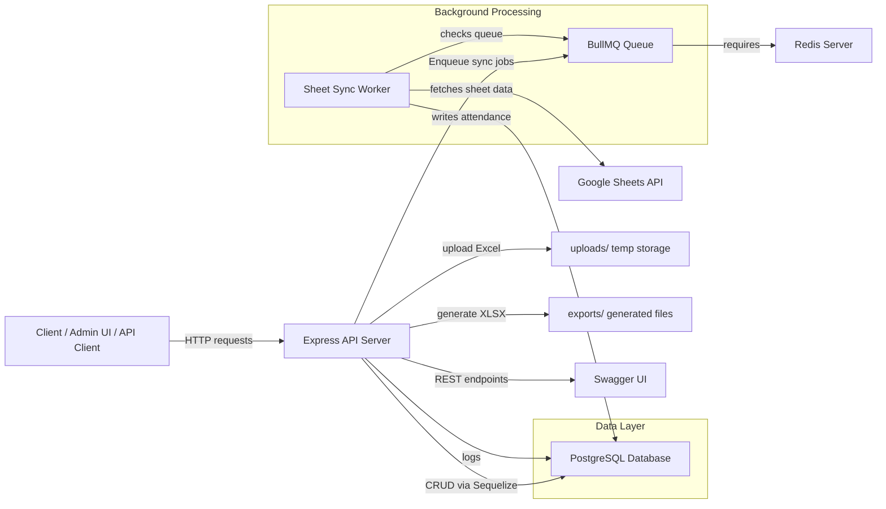
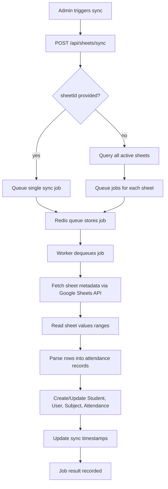

# System Architecture and Process Flow

## 1. Overview

The Student Attendance Management System is a Node.js backend application built with Express and Sequelize. It provides APIs for attendance management, Excel upload/export, student search, batch/section management, Google Sheet sync, and audit logging.

Key components:
- **API Server**: `src/index.js` initializes Express, middleware, routes, Swagger docs, and database sync.
- **Database**: PostgreSQL via Sequelize models in `src/models`.
- **Queue**: Redis-backed BullMQ queue for asynchronous Google Sheet sync jobs.
- **Google Sheets**: `src/services/sheetsService.js` reads attendance data from linked Google Sheets.
- **File Handling**: Excel upload and export logic in `src/utils/excelHandler.js`.
- **Authentication & Logging**: Middleware validates requests and logs API activity.

## 2. System Architecture Diagram



## 3. Component Breakdown

### 3.1 API Server

- Entry point: `src/index.js`
- Middleware:
  - `cors()`
  - `express.json()` / `express.urlencoded()`
  - `authMiddleware` for request authentication
  - `loggingMiddleware` for audit logging
  - `errorHandler` for centralized error responses
- Routes:
  - `/api/attendance`
  - `/api/students`
  - `/api/batches`
  - `/api/sections`
  - `/api/routine`
  - `/api/sheets`
  - `/api/audit`
  - `/api/auth`

### 3.2 Database Layer

- ORM: Sequelize
- Models include:
  - `Student`, `User`, `Batch`, `Section`, `Routine`, `Sheets`, `Attendance`, `Subject`, `AuditLog`
- Associations:
  - Batch → Section → Student → Routine
  - Section → Sheets
  - Student → Attendance → Subject

### 3.3 Queue and Worker

- Job queue: `src/queues/sheetSyncQueue.js`
- Background worker: `src/workers/sheetSyncWorker.js`
- Worker process:
  - Reads queued sync tasks
  - Fetches Google Sheet values
  - Transforms rows into attendance records
  - Persists students, subjects, and attendance into PostgreSQL

### 3.4 Google Sheets Integration

- Service: `src/services/sheetsService.js`
- Uses `googleapis` with service account credentials from `src/utils/keys.json`
- Supports:
  - Linking a Google Sheet URL
  - Validating sheet access
  - Reading attendance values
  - Parsing attendance rows into normalized data

### 3.5 Excel Upload/Export

- Utilities: `src/utils/excelHandler.js`
- Features:
  - Parse uploaded `.xlsx` / `.xls` files
  - Map student rows to attendance records
  - Export filtered attendance data to Excel

## 4. Process Flowcharts

### 4.1 Excel Upload Flow

```mermaid
flowchart TD
  A[User uploads Excel file] --> B[POST /api/attendance/upload]
  B --> C[Multer saves file to uploads/]
  C --> D[parseExcelFile() reads spreadsheet rows]
  D --> E[Create/Find Student records]
  E --> F[Create/Find Subject records]
  F --> G[Upsert Attendance records]
  G --> H[Delete uploaded temp file]
  H --> I[Return success response]
```

### 4.2 Google Sheet Sync Flow



### 4.3 API Request Flow

```mermaid
flowchart TD
  Client -->|HTTP request| API
  API -->|Auth Middleware| Auth
  Auth -->|OK| Router
  Router --> Controller
  Controller -->|Service/Model| Database
  Controller -->|Optional| Queue
  Controller -->|Optional| File system
  Controller --> Response[Send JSON response]
```

## 5. Deployment Notes

### Docker Compose

The repo includes `docker-compose.yml`, which orchestrates:
- `db` → PostgreSQL
- `redis` → Redis
- `app` → Node.js backend

Command:
```bash
docker compose up
```

### Local startup (without Docker)

1. `npm install`
2. Copy `.env.example` to `.env`
3. Configure database and Redis connection values
4. Run `npm run dev`

## 6. Key Integration Points

- `src/index.js` binds the API, middleware, and database
- `src/routes/sheetsRoutes.js` handles sheet linkage and sync job enqueueing
- `src/queues/sheetSyncQueue.js` enqueues jobs in Redis
- `src/workers/sheetSyncWorker.js` executes the sync pipeline
- `src/services/sheetsService.js` performs Google Sheet extraction and DB persistence
- `src/controllers/attendanceController.js` handles Excel uploads and attendance queries

## 7. Recommended Architecture Summary

This system is a typical API-centric backend with the following pattern:
- **Request handling**: Express routes → controllers → services/models
- **Persistent storage**: PostgreSQL via Sequelize
- **Asynchronous work**: Redis + BullMQ worker
- **External integration**: Google Sheets API and file I/O
- **Documentation**: Swagger UI on `/api-docs`

---

For the repo documentation, this file provides both the architecture overview and the process flow for the main upload/sync paths.